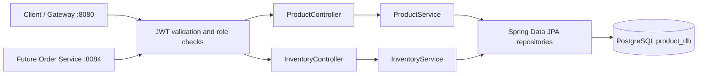

# Product Service

An independent Java 21 / Spring Boot 3 Maven application on port **8083**. It owns the product catalog, inventory counters, and per-order reservations in PostgreSQL `product_db`.

## Documentation

| Document | What it covers |
|---|---|
| [Detailed development notes](docs/DEVELOPMENT_NOTES.md) | Layer-by-layer code walkthrough, JPA, validation, transactions, locking, security, tests, and learning exercises |
| [API walkthrough](docs/API.md) | Requests, responses, authorization, and expected database changes |
| [Inventory consistency](docs/CONCURRENCY.md) | Optimistic locking, retry semantics, and reservation state transitions |
| [Verification record](docs/VERIFICATION.md) | Checks completed and checks still requiring a normal development environment |
| [Postman collection](postman/product-service.postman_collection.json) | Importable requests with example responses and status assertions |
| [Production schema baseline](docs/schema-production.sql) | SQL to review and adopt through a migration tool |

Start with the setup instructions below to run the service. Read the development notes alongside the Java files to understand the implementation.

## Features

- Product creation, lookup, update, soft deletion, and case-insensitive search.
- Database pagination and sorting with an allowed field list.
- Inventory lookup and signed administrative stock adjustments.
- Atomic multi-item reservations and idempotent release/confirmation.
- Version checks to prevent competing orders from overselling stock.
- JWT role authorization, request validation, consistent errors, and correlation IDs.
- Swagger documentation, basic Actuator health, service tests, MockMvc tests, and PostgreSQL integration tests.

**Verification status:** sources compiled and 25 service tests passed using cached-library fallback checks. The exact Maven dependency set, full controller suite, and PostgreSQL integration suite still need verification as described in the [verification record](docs/VERIFICATION.md).

## Architecture



Controllers validate DTOs and delegate. Services own transactions and business rules. Repositories execute database queries; entities protect stock invariants; mappers produce immutable response records. No entity is returned by an API. Order Service must call HTTP APIs and never access this database.

Product creation and initial inventory commit together. Multi-product reservation, release, and confirmation each use a single local transaction. PostgreSQL is required for the per-order transaction lock; this deliberately avoids an in-memory lock that would fail across multiple service instances.

## Project structure

```text
product-service/
├── pom.xml
├── README.md
├── docs/
│   ├── API.md
│   ├── DEVELOPMENT_NOTES.md
│   ├── CONCURRENCY.md
│   ├── VERIFICATION.md
│   └── schema-production.sql
├── postman/product-service.postman_collection.json
├── scripts/concurrent-reservation.ps1
└── src/
    ├── main/
    │   ├── resources/application.yml
    │   └── java/com/ecommerce/product/
    │       ├── ProductServiceApplication.java
    │       ├── enums/
    │       │   ├── ProductStatus.java
    │       │   └── ReservationStatus.java
    │       ├── entity/
    │       │   ├── Product.java
    │       │   ├── Inventory.java
    │       │   └── InventoryReservation.java
    │       ├── dto/
    │       │   ├── request/
    │       │   │   ├── ProductCreateRequest.java
    │       │   │   ├── ProductUpdateRequest.java
    │       │   │   ├── InventoryAdjustmentRequest.java
    │       │   │   ├── InventoryReservationRequest.java
    │       │   │   └── OrderInventoryRequest.java
    │       │   └── response/
    │       │       ├── ProductResponse.java
    │       │       ├── InventoryResponse.java
    │       │       ├── InventoryReservationResponse.java
    │       │       ├── PageResponse.java
    │       │       └── ErrorResponse.java
    │       ├── repository/
    │       │   ├── ProductRepository.java
    │       │   ├── InventoryRepository.java
    │       │   ├── InventoryReservationRepository.java
    │       │   └── OrderTransactionLock.java
    │       ├── mapper/ProductMapper.java
    │       ├── service/
    │       │   ├── ProductService.java
    │       │   ├── InventoryService.java
    │       │   └── impl/
    │       │       ├── ProductServiceImpl.java
    │       │       └── InventoryServiceImpl.java
    │       ├── controller/
    │       │   ├── ProductController.java
    │       │   └── InventoryController.java
    │       ├── exception/
    │       │   ├── ProductNotFoundException.java
    │       │   ├── DuplicateSkuException.java
    │       │   ├── InsufficientStockException.java
    │       │   ├── InvalidInventoryOperationException.java
    │       │   └── GlobalExceptionHandler.java
    │       └── config/
    │           ├── SecurityConfig.java
    │           ├── OpenApiConfig.java
    │           └── CorrelationIdFilter.java
    └── test/
        ├── resources/application-integration.yml
        └── java/com/ecommerce/product/
            ├── ProductServiceTest.java
            ├── InventoryServiceTest.java
            ├── ProductControllerTest.java
            ├── InventoryControllerTest.java
            └── PostgresInventoryIT.java
```

## Maven and configuration

[pom.xml](pom.xml) targets Java 21 and pins Spring Boot 3.5.13 with springdoc 2.8.17. Springdoc's [compatibility matrix](https://springdoc.org/v2/) pairs Boot 3.5.x with springdoc 2.8.x.

[application.yml](src/main/resources/application.yml) sets the service name, port, PostgreSQL connection, JWT trust settings, logging, and health/info exposure. SQL logging is off by default; set `SHOW_SQL=true` for lessons. Timestamps are UTC (entity timestamps use LocalDateTime representing UTC).

The requested combination of Spring Web, Security, and Actuator has unavoidable transitive Micrometer observation APIs. This project adds no metrics code, registry, exporter, tracing, or telemetry integration. It excludes Actuator's metrics core/Jakarta instrumentation dependencies and disables metrics/tracing. A literal zero-Micrometer classpath is incompatible with the requested Spring stack. See [Spring's Actuator documentation](https://docs.spring.io/spring-boot/reference/actuator/metrics.html).

### Environment variables

| Variable | Default | Purpose |
|---|---|---|
| `DB_URL` | `jdbc:postgresql://localhost:5432/product_db` | Application database connection |
| `DB_USERNAME` | `postgres` | Database user |
| `DB_PASSWORD` | Empty | Database password |
| `DDL_AUTO` | `update` | Local schema management; use `validate` with production migrations |
| `SHOW_SQL` | `false` | Enable SQL output during lessons |
| `JWT_ISSUER` | `http://localhost:8081` | Expected token issuer |
| `JWT_JWK_SET_URI` | `http://localhost:8081/.well-known/jwks.json` | Auth Service public signing keys |
| `JWT_AUDIENCE` | `product-service` | Required token audience |
| `TEST_DB_URL` | `jdbc:postgresql://localhost:5432/product_test` | Disposable integration database |
| `TEST_DB_USERNAME` | `postgres` | Integration database user |
| `TEST_DB_PASSWORD` | Empty | Integration database password |

The `TEST_DB_*` variables apply to the integration test configuration. They do not replace application database settings.

## Suggested teaching sequence

1. Read enums and entities: catalog lifecycle, stock invariants, reservation lifecycle.
2. Read request/response records: nested validation, decimal precision, explicit page metadata.
3. Read repositories and mapper: database pagination/search, escaping literal search wildcards, uppercase canonical SKUs.
4. Read service interfaces, then ProductServiceImpl: creation transaction, update, idempotent soft deletion.
5. Read InventoryServiceImpl: signed adjustment, reserve, release, confirm.
6. Read controllers: HTTP status codes, validated parameters, stable allowed sorting.
7. Read exceptions and GlobalExceptionHandler: consistent safe error documents.
8. Read SecurityConfig, OpenApiConfig, and CorrelationIdFilter.
9. Run the tests, then follow the Postman collection.

Product updates accept only name, description, and price. Unknown fields (including SKU, ID, stock, or status) return 400. Blank names, nonpositive prices, more than two decimal places, invalid IDs, empty item lists, and duplicate product IDs are rejected. Catalog pages exclude DELETED products. INACTIVE is modeled for future administration; new reservations require ACTIVE. Deleted SKUs remain reserved permanently.

## Errors, security, Swagger, and health

Public access: product GET routes, Swagger documentation, and health. ADMIN: create/update/delete products and adjust inventory. ADMIN or SERVICE: inventory lookup. SERVICE: reserve/release/confirm. All other routes are denied; info requires ADMIN.

The service validates **RS256 JWTs**, obtained from your Auth Service, against its JWKS endpoint. It checks issuer, audience, timestamps, and signature. Roles are read from a top-level `roles` array containing `ADMIN` or `SERVICE`; they become Spring authorities `ROLE_ADMIN` or `ROLE_SERVICE`. A valid token for a different audience is rejected. This service does not issue tokens, include demo secrets, or implement an Auth Service.

Example decoded claims (not a token):

```json
{"iss":"http://localhost:8081","aud":["product-service"],"sub":"order-service","roles":["SERVICE"],"exp":1893456000}
```

CSRF is disabled for these stateless bearer APIs. No cookie login or HTTP Basic is enabled. Configure HTTPS URLs for the Auth Service outside local training. The JWKS URL is explicit, so public browsing/startup does not require Auth Service discovery; authenticated requests require reachable signing keys.

Swagger UI: http://localhost:8083/swagger-ui/index.html  
OpenAPI JSON: http://localhost:8083/v3/api-docs  
Health: http://localhost:8083/actuator/health

Use Swagger's **Authorize** button with a token from Auth Service. OpenAPI includes DTO validation, examples, status codes, error schema, and bearer requirements. Only health/info Actuator endpoints are exposed.

Every response carries `X-Correlation-Id`. A supplied ID of 1–64 letters, digits, dots, underscores, or hyphens is preserved; otherwise a UUID is generated. It appears in logs and error JSON. Tokens, credentials, and adjustment reason text are not logged.

## Local startup and testing

Install **JDK 21**, Maven 3.9+, and PostgreSQL locally. Confirm `java -version` and `mvn -version` both use Java 21.

Create databases with PostgreSQL tools (Windows may require their full paths):

```shell
createdb -U postgres product_db
createdb -U postgres product_test
```

Or execute `CREATE DATABASE product_db;` and `CREATE DATABASE product_test;` in psql/pgAdmin, outside a transaction.

Configure environment variables in PowerShell:

```powershell
$env:DB_USERNAME = "postgres"
$env:DB_PASSWORD = Read-Host "PostgreSQL password"
$env:JWT_ISSUER = "http://localhost:8081"
$env:JWT_JWK_SET_URI = "http://localhost:8081/.well-known/jwks.json"
$env:JWT_AUDIENCE = "product-service"
mvn clean verify
mvn spring-boot:run
```

On Bash, use `export DB_USERNAME=postgres`, `read -s DB_PASSWORD; export DB_PASSWORD`, and corresponding `export JWT_...=...` commands. Environment values must match your actual Auth Service. Do not commit passwords or tokens.

To run the packaged application:

```shell
java -jar target/product-service-1.0.0.jar
curl http://localhost:8083/actuator/health
```

Health returns `{"status":"UP"}` when the database is reachable. Import [the Postman collection](postman/product-service.postman_collection.json), set its `adminToken` and `serviceToken` variables using Auth Service tokens, and run in order. It captures product/order IDs and asserts expected statuses. Saved responses illustrate the business scenarios.

Unit/service and MockMvc tests require no PostgreSQL or Auth Service:

```shell
mvn test
```

Integration tests use **real PostgreSQL**, never H2 or Docker:

```powershell
$env:TEST_DB_URL = "jdbc:postgresql://localhost:5432/product_test"
$env:TEST_DB_USERNAME = "postgres"
$env:TEST_DB_PASSWORD = $env:DB_PASSWORD
mvn -Pintegration verify
```

The integration profile uses `create-drop` and clears its tables between tests. Point it only at the dedicated disposable `product_test` database. It does not silently skip tests when PostgreSQL is unavailable. Failsafe runs `*IT`; Surefire runs unit and controller `*Test` classes. The concurrency test uses separate transactions and a barrier forcing both contenders to read the same version.

Inspect data:

```sql
SELECT id, sku, name, price, status FROM products ORDER BY id;
SELECT product_id, total_quantity, reserved_quantity,
       total_quantity - reserved_quantity AS available, version
FROM inventory ORDER BY product_id;
SELECT order_id, product_id, quantity, status, version
FROM inventory_reservations ORDER BY order_id, product_id;
```

See [API examples and inventory changes](docs/API.md), [concurrency explanation](docs/CONCURRENCY.md), and [verification results](docs/VERIFICATION.md).

## Troubleshooting

| Symptom | What to check |
|---|---|
| Maven uses the wrong Java version | Compare `java -version` with `mvn -version`; set `JAVA_HOME` and PATH to JDK 21 |
| Dependencies cannot be downloaded | Check Maven Central connectivity, proxy settings, and local repository write access |
| PostgreSQL connection refused | Confirm PostgreSQL is running and `DB_URL` has the correct port and database |
| Database authentication failed | Check `DB_USERNAME`, `DB_PASSWORD`, and PostgreSQL authentication configuration |
| Port 8083 is occupied | Stop the conflicting local process or set `SERVER_PORT` and update client URLs |
| Protected endpoint returns 401 | Check bearer token, signing keys, issuer, audience, and token timestamps |
| Protected endpoint returns 403 | Check the top-level `roles` claim against the endpoint's required role |
| Reservation returns 409 | Read the error code: insufficient stock, changed order payload, invalid state, and version conflicts require different responses |
| Integration tests remove test data | They intentionally use `create-drop`; configure a dedicated disposable database |
| An adjusted quantity increases twice | Adjustment applies a delta and is not retry-safe; inspect current stock before taking corrective action |

For a reproducible last-unit race, create an ACTIVE product with one available unit and run [the concurrency script](scripts/concurrent-reservation.ps1) with PowerShell 7 and a SERVICE token.

## Production schema management

`ddl-auto: update` is a local teaching convenience, not a migration strategy. For production, use a dedicated database role and set `DDL_AUTO=validate`. Add Flyway (`flyway-core` and `flyway-database-postgresql`) or Liquibase, and move the reviewed [schema baseline](docs/schema-production.sql) into `db/migration/V1__initial_schema.sql` or a Liquibase changelog. Apply migrations before Hibernate validation. The SQL is documentation and is not run automatically.

On an existing database, inspect and reconcile its schema before baselining; do not run a fresh CREATE TABLE baseline over existing tables. Subsequent changes belong in new, reviewed versioned migrations. The baseline includes foreign keys, uniqueness, positive prices/quantities, and counter checks. Retain reservation history for idempotency; do not purge or reuse an order ID while clients can retry it.

No gateway, Order Service, Feign client, Resilience4j client, Eureka, Docker, Kubernetes, Lombok, Config Server, or telemetry exporter is included. Future Order Service clients should set HTTP timeouts and retry only appropriate failures with the same order ID and identical payload. A reservation response may report a terminal status on replay; clients must inspect it.
