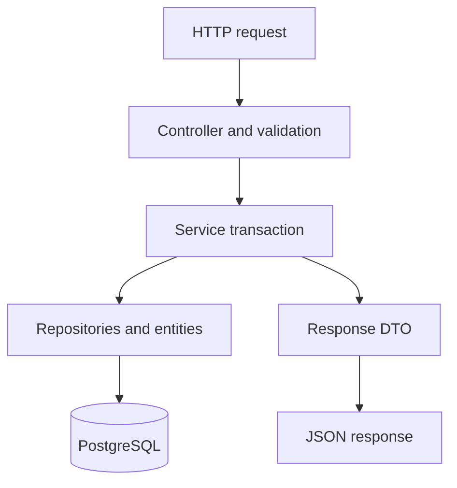
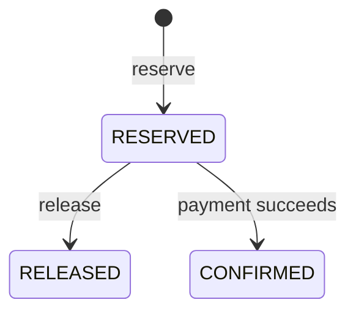
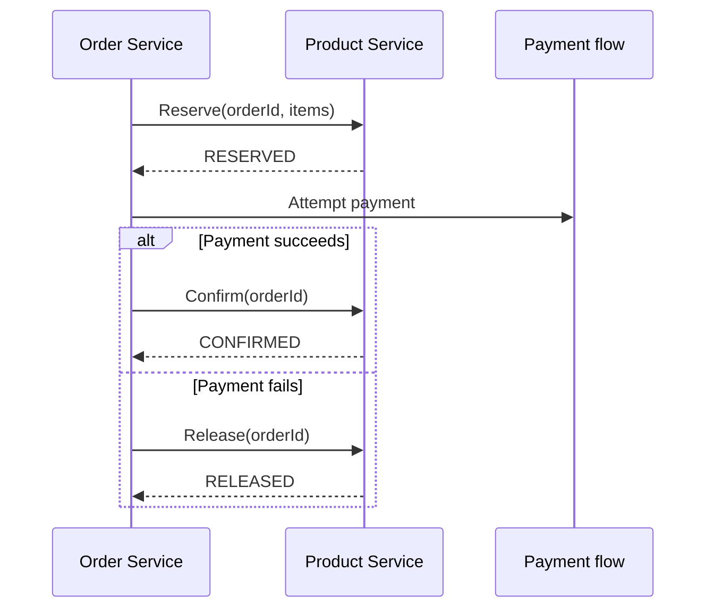

# Product Service: detailed development notes

These notes explain the code in this repository for Java and Spring Boot students. Use the [README](../README.md) for setup, the [API walkthrough](API.md) for complete requests and responses, and the [verification record](VERIFICATION.md) to distinguish implemented tests from completed checks.

## Learning path

1. Understand service ownership and the layered architecture.
2. Read the entities, DTOs, repositories, and mapper.
3. Follow Product CRUD, then inventory adjustment.
4. Study reservation, release, and confirmation.
5. Understand transaction rollback, optimistic locking, and idempotency.
6. Review errors, logging, OpenAPI, and configuration.
7. Run the tests and practice the inventory scenarios.

## 1. Service ownership and architecture

Product Service owns catalog details, stock counters, and reservation records. Order Service will own order lifecycle information. Authentication is outside this application boundary.

A reservation's order ID is a business reference. It does not grant Product Service ownership of the order, and there is no foreign key into another service's database.



Controllers validate input and delegate. Services coordinate business rules inside transactions. Repositories execute database operations. Entities represent persistent state and protect valid state changes. DTOs define the HTTP contract without exposing persistence entities.

## 2. Dependencies and startup

Read [pom.xml](../pom.xml) and [ProductServiceApplication](../src/main/java/com/ecommerce/product/ProductServiceApplication.java).

| Dependency | Responsibility |
|---|---|
| Spring Web | HTTP routing, controllers, JSON conversion |
| Spring Data JPA | Entity persistence and repository implementations |
| Spring Validation | Jakarta Validation constraints |
| Lombok | Generated getters, constructors, and loggers |
| PostgreSQL driver | JDBC communication with PostgreSQL |
| Springdoc | OpenAPI specification and Swagger UI |
| Actuator | Basic health and info endpoints |
| Spring Boot Test | JUnit, Mockito, Spring tests, MockMvc |

The POM targets Java 21 and pins Boot 3.5.13 and springdoc 2.8.17. These are the project's configured versions.

The main method calls `SpringApplication.run`. The application class sits in `com.ecommerce.product`, allowing component scanning to discover its child packages.

During startup, Spring creates components, injects dependencies, configures repositories and JPA, and registers controllers. Database configuration must be valid for the application to initialize successfully.

The service does not implement authentication. All application endpoints are currently public; deployments that need authentication should enforce it at the gateway or add a dedicated security layer.

## 3. Packages and constructor injection

| Package | Responsibility |
|---|---|
| `controller` | HTTP routes, request validation, status codes |
| `service` | Business operation interfaces |
| `service.impl` | Transactional use cases |
| `repository` | Database access and order transaction locking |
| `entity` | Persistent state and domain operations |
| `dto.request` | Accepted fields and input constraints |
| `dto.response` | Response shape |
| `mapper` | Product entity/DTO conversion |
| `enums` | Lifecycle values |
| `exception` | Business exceptions and HTTP error mapping |
| `config` | OpenAPI and request configuration |

Dependencies arrive through constructors. For example, InventoryServiceImpl receives the product, inventory, and reservation repositories plus OrderTransactionLock.

Constructor injection makes required dependencies explicit and lets unit tests supply mocks. Interfaces describe available operations, while implementation classes contain orchestration. Inventory arithmetic stays in the entity; operations involving multiple entities stay in services.

## 4. Entities and database design

Read the [entity package](../src/main/java/com/ecommerce/product/entity).

### Product

Product stores a generated ID, unique SKU, name, description, price, status, version, and timestamps.

- ID is a technical database identity.
- SKU is a business identifier normalized to uppercase by the mapper.
- Price uses `BigDecimal` and a `numeric(19,2)` column.
- Status is stored using a string enum.
- Version detects stale concurrent changes.
- LocalDateTime timestamps represent UTC in this implementation.

Decimal money values should not depend on the binary approximation of `double`. Request validation permits up to 17 integer digits and two fractional digits.

Product states are ACTIVE, INACTIVE, and DELETED. Creation sets ACTIVE. The current API supports soft deletion but has no operation to toggle INACTIVE. Catalog reads exclude DELETED; new reservations specifically require ACTIVE.

A deleted product retains its SKU. Deleting a product therefore does not make its SKU available for reuse.

### Inventory

Inventory stores product ID, total quantity, reserved quantity, version, and update timestamp. Product ID is unique and references a local product. The entity also maps a read-only product association while exposing the scalar product ID for the service's operations.

The invariant is:

```text
totalQuantity >= 0
reservedQuantity >= 0
reservedQuantity <= totalQuantity
availableQuantity = totalQuantity - reservedQuantity
```

Available quantity is derived rather than stored, avoiding another counter that could disagree with the other two. Entity methods and database CHECK constraints guard the stored values.

### InventoryReservation

A reservation stores order ID, product ID, quantity, status, version, and timestamps. Quantity is positive, and the pair `(order_id, product_id)` is unique.



RELEASED and CONFIRMED are terminal states. Repeating the same completion is a no-op; switching between terminal states is rejected.

Reservation history is essential for idempotency. Counters alone cannot tell whether a particular order has already deducted stock.

## 5. DTOs, validation, and mapping

Read the [request DTOs](../src/main/java/com/ecommerce/product/dto/request) and [ProductMapper](../src/main/java/com/ecommerce/product/mapper/ProductMapper.java).

Records provide concise immutable request/response carriers. DTOs avoid exposing JPA relationships, internal version fields, or unwanted mutation paths.

| Field | Rule |
|---|---|
| SKU | Required, maximum 64 characters, supported letter/digit/dot/underscore/hyphen pattern |
| Name | Required, maximum 200 characters |
| Description | Optional, maximum 2,000 characters |
| Price | Required, positive, maximum two decimal places |
| Initial quantity | Required, zero or positive |
| Product/order IDs | Positive |
| Reservation items | Nonempty, maximum 100 lines, valid nonnull items |
| Reservation quantity | Positive integer |
| Adjustment reason | Required, maximum 500 characters |
| Adjustment change | Required integer; business logic rejects zero and invalid resulting stock |

Nested `@Valid` checks each reservation item. Duplicate product IDs are rejected in service logic because they require a cross-item check.

Unknown JSON properties are rejected. A product update containing SKU, ID, or inventory fields returns 400. Fractional JSON quantities are not silently truncated to integers.

There are three validation layers:

1. HTTP request constraints reject invalid input.
2. Entity methods protect business state changes.
3. Database constraints protect persisted integrity.

Direct Java calls to services do not automatically run the DTO's validation annotations: these services do not enable method-level Bean Validation. The HTTP controller is the normal validation entry point.

ProductMapper normalizes SKU, constructs a Product from a creation request, applies supported update fields, and creates a ProductResponse.

## 6. Product CRUD walkthrough

Read [ProductServiceImpl](../src/main/java/com/ecommerce/product/service/impl/ProductServiceImpl.java).

### Create product

1. Normalize the SKU.
2. Check whether it already exists.
3. Map the request to a new ACTIVE product.
4. Save and flush the product.
5. Create its initial inventory.
6. Return a DTO after the transactional service call completes successfully.

Product and inventory share one transaction. Failure creating inventory rolls back the product insert.

The preliminary SKU query gives an understandable business failure but is not enough for concurrency. Two requests can both observe absence before inserting. The database unique constraint resolves that race.

### Read product

Find the product and filter out DELETED. Missing and deleted products return 404. INACTIVE products remain visible in catalog reads.

### Update product

Load a visible product, change name/description/price, and flush. ID and SKU are immutable through this endpoint. Inventory changes belong to a separate API.

This is a full details update: name and price are mandatory. An omitted description becomes null.

### Delete product

Set status to DELETED rather than deleting the row. Repeating deletion of an existing deleted row returns 204. An unknown ID returns 404.

Retaining product and inventory rows allows an already-reserved order to finish or compensate.

## 7. Pagination and search

Read [ProductController](../src/main/java/com/ecommerce/product/controller/ProductController.java) and [ProductRepository](../src/main/java/com/ecommerce/product/repository/ProductRepository.java).

Pages start at zero. Size is limited to 1 through 100. Sort accepts an allowed property and direction, such as `price,desc`.

Allowed properties are id, sku, name, price, createdAt, and updatedAt. ID is added as a secondary ordering where appropriate to break ties.

The database applies filtering, sorting, and pagination. The service maps the returned page into a DTO with content, page, size, totalElements, totalPages, and last. It never loads the entire catalog to search in memory.

Search matches name or SKU case-insensitively, excludes deleted rows, and escapes literal SQL LIKE wildcard characters. Empty results return an empty successful page.


## 8. Inventory arithmetic and adjustment

Read [Inventory](../src/main/java/com/ecommerce/product/entity/Inventory.java).

For total=100 and reserved=20, available=80. Adding 50 stock gives total=150, reserved=20, available=130.

Removing 90 from the original stock would leave total=10 with 20 reserved. The entity rejects it because already-promised stock cannot exceed physical stock.

The adjustment calculation uses a wider `long` temporary to detect overflow before converting back to `int`. Zero adjustments and results beyond Integer.MAX_VALUE are rejected.

Adjustment changes no reservation record and is not idempotent: repeating +50 applies another +50. The reason is validated but is not stored as a durable audit record in this version.

## 9. Reservation flow

Read [InventoryServiceImpl](../src/main/java/com/ecommerce/product/service/impl/InventoryServiceImpl.java).

```json
{
  "orderId": 5001,
  "items": [
    {"productId": 1001, "quantity": 2},
    {"productId": 1002, "quantity": 1}
  ]
}
```

The service:

1. Builds a sorted product-to-quantity map and rejects duplicate product IDs.
2. Acquires the order's transaction lock.
3. Checks for existing reservations.
4. For a replay, compares the complete product/quantity set.
5. For a new order, checks that each product exists and is ACTIVE.
6. Loads inventory and reserves each quantity.
7. Flushes inventory changes and saves all reservation rows.
8. Returns the reservation response, subject to successful transaction completion.

Using a TreeMap creates a consistent product order. Hibernate also orders updates, reducing opportunities for competing transactions to acquire row locks in opposite orders.

With total=100 and reserved=0, a reservation of two produces total=100, reserved=2, available=98.

All lines participate in the same transaction. If product 1002 lacks stock, product 1001's changes roll back. A partially successful reservation is not returned.

## 10. Release and confirmation

Both operations accept an order ID and process all stored reservation lines.

| Operation for two units | Total | Reserved | Available |
|---|---:|---:|---:|
| Starting stock | 100 | 0 | 100 |
| Reserve | 100 | 2 | 98 |
| Confirm after reserve | 98 | 0 | 98 |
| Release instead of confirm | 100 | 0 | 100 |

Release subtracts from reserved only. Confirmation subtracts from both total and reserved: those units leave physical stock and stop being outstanding reservations.

Confirmation does not change available quantity because the units were already unavailable to other orders.

| Existing status | Action | Result |
|---|---|---|
| RESERVED | Release | Change counters and mark RELEASED |
| RELEASED | Release | Return existing state; no counter change |
| RESERVED | Confirm | Change counters and mark CONFIRMED |
| CONFIRMED | Confirm | Return existing state; no counter change |
| RELEASED | Confirm | 409 |
| CONFIRMED | Release | 409 |
| Unknown order | Either | 409 |

Completion operates on stored reservations and inventory without requiring the product to remain ACTIVE. Soft deletion therefore does not strand an existing reservation.

## 11. Transactions and dirty checking

Service classes default to `@Transactional(readOnly = true)`. Mutating operations override that with normal `@Transactional`.

| Operation | Atomic state changes |
|---|---|
| Create product | Product plus initial inventory |
| Update/delete | Product fields or status |
| Adjust | Inventory counters/version |
| Reserve | All inventory counters and reservation inserts |
| Release | All counters and RELEASED statuses |
| Confirm | All counters and CONFIRMED statuses |

An entity loaded inside the persistence context is managed. JPA detects modified fields and writes updates during flushing. This explains why existing inventory rows do not need an explicit `save` call after every entity method.

**Flush is not commit.** Flush sends SQL within the transaction and may reveal a version or constraint failure. Commit makes the complete transaction durable. SQL from an earlier flush can still be rolled back.

The business exceptions here are unchecked. When they leave a transactional service method, Spring's ordinary rollback rules undo its database changes.

Spring applies transactions through a proxy. A direct call to another method on the same instance does not create a new proxy transaction. The private `complete` helper is safe in this design because its public release/confirm caller already started the transaction.

The read-only annotation communicates transaction intent; it does not change endpoint access.

## 12. Optimistic locking and overselling

Imagine one available unit and two different orders.

| Step | Order A | Order B |
|---|---|---|
| Read | Stock 1, version 0 | Stock 1, version 0 |
| Decide | Reserve one | Reserve one |
| Attempt update | Version 0 to 1 | Version 0 to 1 |
| If A commits first | Success | Stale version; rollback |

Hibernate includes the old version in its update condition. Conceptually:

```sql
UPDATE inventory
SET reserved_quantity = 1, version = 1
WHERE id = 100 AND version = 0;
```

Only one committed update can consume version 0. A stale update affects no row and raises an optimistic locking exception.

The API returns 409 CONCURRENT_INVENTORY_CONFLICT. Every other change in the losing transaction rolls back too.

If order B reads after A commits, it sees no availability and returns INSUFFICIENT_STOCK instead. Both outcomes prevent overselling.

Optimistic locking does not mean that PostgreSQL never locks rows. An update may wait for another transaction's row lock before the version mismatch is resolved.

Inventory, products, and reservations have version fields. Product reservation reads request an optimistic product lock so a concurrent product change can invalidate a stale eligibility decision.

A failed transaction must not be retried by continuing to use the same transaction. A client can retry an appropriate failure as a new complete HTTP operation.

## 13. Idempotency and per-order locking

Idempotency means applying the same logical operation again does not apply its effect twice. A replay may return a later status, so the response need not remain byte-for-byte identical over time.

The unique order/product pair alone is insufficient for whole-order idempotency: two calls using one order ID but disjoint product sets would not violate that constraint.

[OrderTransactionLock](../src/main/java/com/ecommerce/product/repository/OrderTransactionLock.java) uses:

```sql
select 1 from pg_advisory_xact_lock(:orderId)
```

The PostgreSQL advisory transaction lock serializes reserve/release/confirm for the same order, including the first request when no reservation exists. It releases automatically at transaction completion and coordinates multiple application instances using the same database.

| Mechanism | Purpose |
|---|---|
| Inventory version | Detect different orders racing for shared stock |
| Order advisory lock | Serialize operations/retries for the same order |
| Unique order/product pair | Prevent duplicate persisted reservation lines |

Exact reserve replays return existing states. Reordering items is accepted. Changing any product or quantity returns 409. Replaying a released or confirmed order does not reserve stock again.

Unknown-order release/confirm returns 409 and creates no cancellation tombstone. A release that arrives before reserve does not prevent a later reservation. The caller must sequence operations and handle ambiguous network outcomes.

Do not blindly retry every conflict. Insufficient stock, changed payloads, and terminal-state violations need business decisions; transient concurrency failures may justify retrying the same request.

See [Inventory consistency](CONCURRENCY.md) for additional discussion.

## 14. API access

The application does not contain an authentication or authorization layer. All catalog and inventory endpoints are currently public and accept requests without bearer headers.

If the service is deployed outside a trusted network, enforce authentication and authorization at an API gateway or add a dedicated security module. That external layer should protect mutation and internal inventory routes according to the deployment's requirements.

## 15. Errors and logging

Read [GlobalExceptionHandler](../src/main/java/com/ecommerce/product/exception/GlobalExceptionHandler.java).

| Failure | Status | Typical code |
|---|---:|---|
| Missing/deleted product | 404 | PRODUCT_NOT_FOUND |
| Duplicate SKU | 409 | DUPLICATE_SKU |
| Stock shortage | 409 | INSUFFICIENT_STOCK |
| Invalid inventory state change | 409 | INVALID_INVENTORY_OPERATION |
| Version conflict | 409 | CONCURRENT_INVENTORY_CONFLICT |
| Invalid body constraint | 400 | VALIDATION_ERROR |
| Invalid body/path/query | 400 | INVALID_REQUEST |
| Unexpected failure | 500 | INTERNAL_ERROR |

Responses contain timestamp, status, code, and path. Validation can add field errors; insufficient stock adds available/requested quantities. Unexpected failures do not expose SQL or stack traces in HTTP responses.

Mutation logs include relevant product, order, and quantity identifiers. Credentials and request-sensitive text are not logged.

Service event logs are written before transaction completion, so a log line alone is not proof that the operation committed.


## 16. Configuration, Swagger, and health

Read [application.yml](../src/main/resources/application.yml) and the environment-variable table in the README.

The application uses port 8083 and the product_db database by default. Environment overrides supply database credentials. Test database variables are separate from normal application variables.

Open Session in View is disabled. Services should finish persistence work before returning DTOs; controllers must not rely on lazy loading while rendering a response.

Entity timestamps use UTC. SQL logging is off by default and can be enabled with SHOW_SQL=true during a lesson.

OpenAPI describes operations, validation constraints, examples, and errors. Swagger UI is an interactive client for this public API.

| Purpose | Local URL |
|---|---|
| Catalog | http://localhost:8083/api/products |
| Inventory | http://localhost:8083/internal/api/inventory |
| Swagger UI | http://localhost:8083/swagger-ui/index.html |
| OpenAPI JSON | http://localhost:8083/v3/api-docs |
| Health | http://localhost:8083/actuator/health |

Actuator exposes health/info only, and public health details are hidden. Metrics and tracing are disabled. Spring's transitive Micrometer observation APIs remain; the project does not add registries, tracing, or telemetry exporters.

## 17. Testing strategy and verification status

Read the [test package](../src/test/java/com/ecommerce/product) and [verification record](VERIFICATION.md).

### Service tests

Mockito supplies repository dependencies. Tests exercise duplicate SKU, product lookup, updates/deletion, stock shortage, exact replay, changed payloads, completion rules, and invalid adjustments.

Mock repositories cannot prove database rollback or concurrent update behavior. These tests establish service decisions under controlled inputs.

### Controller tests

WebMvcTest loads an MVC slice and a mocked service. MockMvc exercises routing, request validation, JSON shapes, HTTP status codes, and error handling.

### PostgreSQL tests

PostgresInventoryIT loads the application with real repositories and a disposable PostgreSQL database. It checks:

- Product creation rollback when inventory fails.
- Atomic multi-item reservation failure.
- Competing orders for the last unit.
- Concurrent exact retries.
- Same-order requests with different payloads.
- Concurrent confirm-versus-release.
- Repeated confirmation and reserve replay after completion.
- Completion after soft deletion.
- Database rejection of invalid counters.

The last-unit test uses two transactions and a barrier to ensure both observe the same inventory version before trying to reserve. This makes the optimistic conflict intentional rather than dependent on chance timing.

### Commands

```shell
mvn test
mvn -Pintegration verify
```

Surefire runs the service/controller Test classes. The integration Maven profile adds Failsafe's IT execution.

The integration configuration uses create-drop and clears tables between tests. It must point to a dedicated product_test database, not application data.

The test suite contains service, controller, and PostgreSQL integration tests. The standard `mvn test` command runs unit and controller tests; the integration Maven profile runs the PostgreSQL tests. Test existence and successful test execution are different claims.

## 18. Guided local practice

### Prepare and start

1. Install Java 21, Maven, and PostgreSQL.
2. Check that java -version and mvn -version use Java 21.
3. Create product_db and a separate product_test database.
4. Configure database environment variables from the README.
5. Build, then start the application.

```shell
mvn clean verify
mvn spring-boot:run
```

Check health and open Swagger UI. Import the [Postman collection](../postman/product-service.postman_collection.json) and run requests in order.

### Follow the stock changes

The collection follows this sequence:

| Step | Total | Reserved | Available |
|---|---:|---:|---:|
| Create with 100 | 100 | 0 | 100 |
| Adjust +50 | 150 | 0 | 150 |
| Reserve two for first order | 150 | 2 | 148 |
| Replay reserve | 150 | 2 | 148 |
| Release first order | 150 | 0 | 150 |
| Replay release | 150 | 0 | 150 |
| Reserve two for second order | 150 | 2 | 148 |
| Confirm second order | 148 | 0 | 148 |
| Replay confirmation | 148 | 0 | 148 |
| Request insufficient stock | 148 | 0 | 148 |

Inspect persisted results:

```sql
SELECT product_id, total_quantity, reserved_quantity,
       total_quantity - reserved_quantity AS available_quantity, version
FROM inventory ORDER BY product_id;

SELECT order_id, product_id, quantity, status, version
FROM inventory_reservations ORDER BY order_id, product_id;
```

Stock counters should agree with the reservation states. A no-op replay should not deduct another quantity.

### Observe concurrency

Create a fresh ACTIVE product with one available unit. Replace 1003 below with its actual ID and run PowerShell 7:

```powershell
./scripts/concurrent-reservation.ps1 -ProductId 1003
```

Expected outcome: one successful reservation and one conflict, leaving total=1, reserved=1, available=0. The sequential Postman runner does not by itself test simultaneous requests.

## 19. Future Order Service integration

Feign and Resilience4j will belong in the future caller. This Product Service already exposes the HTTP contracts it will need.



Each inventory call is a local transaction. It cannot atomically commit with a separate payment system. Failures between steps require recovery or Saga compensation.

When a response is lost, the client may not know whether the server committed. Replaying the same order operation recovers stored state without applying its effect twice.

Current boundaries:

| Topic | Current behavior |
|---|---|
| Reservation expiry | No automatic expiry or cleanup scheduler |
| Unknown-order completion | Rejected; no cancellation tombstone |
| Adjustment audit | Reason validated, no durable audit history |
| INACTIVE administration | State modeled, no toggle API |
| Product deletion | Soft deletion, reservation completion retained |
| Price/currency history | Not modeled |
| Multi-warehouse stock | Not modeled |
| Other services | Not generated in this project |

These are possible extensions, not existing capabilities.

## 20. Schema migrations and deployment preparation

Local ddl-auto=update is a training convenience. For deployment, adopt Flyway or Liquibase and set DDL_AUTO=validate.

The [SQL baseline](schema-production.sql) is a starting point for a reviewed migration on a new database. It is not automatically executed by this application.

For an existing database, inspect and reconcile its schema before baselining. Subsequent changes should be new versioned migrations. Preserve foreign keys, uniqueness, positive quantity/price checks, and inventory bounds.

Keep reservation records for as long as legitimate retries can arrive. Purging them or reusing order IDs changes the idempotency contract.

Before deployment, run the complete declared dependency build, PostgreSQL suite, and API checks through the deployment's configured access layer.

## 21. Review questions and exercises

### Questions with answers

**Why does reservation leave total unchanged?**  
The stock still exists; it is temporarily unavailable to other orders.

**Why does confirmation reduce both total and reserved?**  
Sold units leave physical stock and are no longer pending reservations.

**Why is the SKU database constraint needed after checking existsBySku?**  
Concurrent requests may both pass the initial query before either inserts.

**Does flush commit a transaction?**  
No. It sends SQL while rollback remains possible.

**Why use both order locks and inventory versions?**  
Order locks serialize one order's operations. Inventory versions detect different orders competing for the same stock.

**Why would an in-memory mutex be insufficient?**  
Different application instances do not share process memory.

**Can release undo confirmation?**  
No. A refund/return would need a separate business operation.

**Does checking availability guarantee the next reservation succeeds?**  
No. Availability is a snapshot; another order may reserve first.

**Is adjustment safe to retry automatically?**  
No. A delta is applied again unless another idempotency mechanism is designed.

**Why retain inventory after product deletion?**  
Existing reservations must still be confirmed or released.

### Exercises

1. Trace product creation from controller to SQL and identify every possible rollback point.
2. Submit negative and fractional quantities and compare the validation responses.
3. Submit duplicate product IDs and explain why the service rejects them.
4. Reserve two products with one shortage and confirm that neither stays reserved.
5. Confirm an order twice and compare counters and version values.
6. Replay a reservation with a changed quantity and explain the 409 result.
7. Run the last-unit race and distinguish stock shortage from stale-version conflict.
8. Propose expiry logic that handles a simultaneous confirmation.
9. Design a durable stock-adjustment audit record and an idempotency key.

Exercises 8 and 9 are design extensions; the current code does not implement them.

